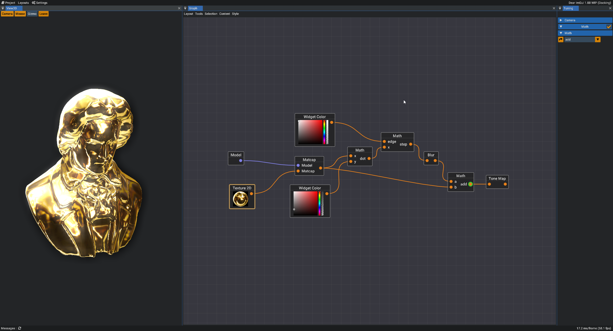
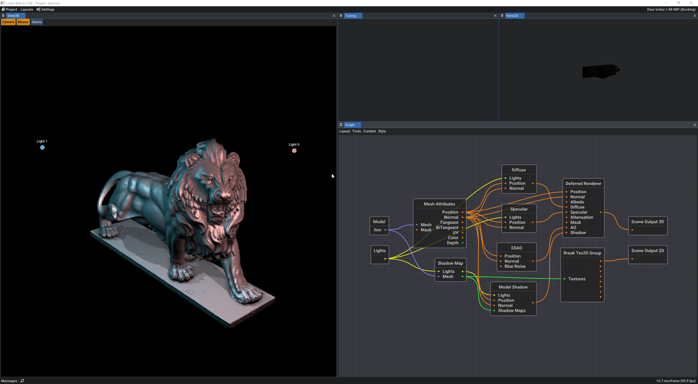
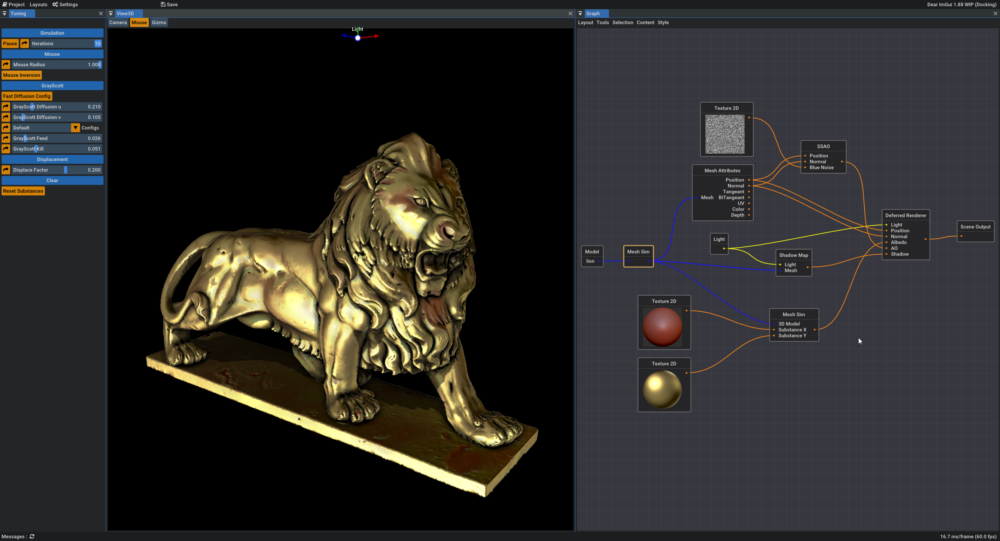

# Lumo
Lumo is a realtime rendering presentation / lab software for 3D models

# why this name ?
Lumo is "Light" in Esperanto, its a short and pretty word to me :)

# Goals :

* Implement all realtime rendering Algo used in Games / realtime Presentation softwares
* Mastering all theses tech for learning purposes
* Implement my own idea ( by ex related to SubSurface Scatering, or Shadows )
* Implement a modern use of 3D vulkan Api, and Node Graph related stuff
* Can Render mesh's or sdf's in the same way
* And finally can export rendering to picture, video, and maybe a self little portable binary form to be used everywhere
* Implement some specific VFX algo by plugigns like (compute based mesh sim, morphogenesis, sdf meshing)
* all these algos at max as possible in GPU only (include mesh generation)

at least, support all rendering features and result of the SketchFab Renderer (yes im loving it haha)

# Gettings Started 

- Create a new project (automatically saved when you quit the soft for the moment for easier dev)
- Click right in the graph and add nodes.
- Left mouse double click on a texture slot (Orange) of nodes for show the result in the 3d viewport
- Middle mouse double click on a texture slot (Orange) of nodes for show the result in the 2d viewport
- select a node and you can tune it in the tuning pane

## to note :
 the resize events are propagated from the head of the graph (the head is the texture slots you selected)
 so when you just select a texture slot from a already created node, maybe you need to reisze the 3d viewport for make it updated.
 (to fix in few version, the resize system will be improved, but its not my priority, for the moment)

thats all

# How to build

## Build dependencies

* Vulkan SDK 1.2 at least : [latest](https://vulkan.lunarg.com/) and a compatible GPU
* Python 3.7 at least : [latest](https://www.python.org/downloads/)

## Cmake

You need to use cMake. 
You can use the gui (my prefered way).
but, if you run cmake by command line, For the 3 Os (Win, Linux, MacOs), the cMake usage is exactly the same,

    Choose a build directory. (called here my_build_directory for instance) and
    Choose a Build Mode : "Release" / "MinSizeRel" / "RelWithDebInfo" / "Debug" (called here BuildMode for instance)
    Run cMake in console : (the first for generate cmake build files, the second for build the binary)

cmake -B my_build_directory -DCMAKE_BUILD_TYPE=BuildMode
cmake --build my_build_directory --config BuildMode

Some cMake version need Build mode define via the directive CMAKE_BUILD_TYPE or via --Config when we launch the build. This is why i put the boths possibilities

## Platforms Support

all libs and code used here are cross platform, so compatible (win, linux). 

The mac platform is not supported for the moment, due to the vulkan driver. 

Could be tested at some stage with the Molten-VK implementation.. 

But i not tested it for the moment, So i know he compile fine on Windows with MSVC or clang, for the moment that's all.

# Tech's to implement :

| Published | Feature | status |
| - | - | - |
| :black_square_button: | Geometry Shader |  |
| :black_square_button: | Tesselation Shader |  |
| :white_square_button: | Compute Shader |  |
| :white_square_button: | Vulkan Framework |  |
| :white_square_button: | Mesh Use |  |
| :white_square_button: | Mesh Texturing |  |
| :white_square_button: | Plugin system |  |
| :black_square_button: | Sdf Merging |  |
| :white_square_button: | Node Graph |  |
| :black_square_button: | Sub Node Graph |  |
| :black_square_button: | Instancing |  |
| :white_square_button: | SkyBox (Cubemap, LongLat) |  |
| :white_square_button: | Cell Shading |  |
| :black_square_button: | PBR Shading |  |
| :white_square_button: | Shadow Mapping |  |
| :white_square_button: | Deferred Rendering |  |
| :black_square_button: | GLTF Rendering |  |
| :white_square_button: | RTX Rendering |  |
| :white_square_button: | RTX : Raygen Shader |  |
| :white_square_button: | RTX : Any hit Shader |  |
| :white_square_button: | RTX : Closest hit Shader |  |
| :white_square_button: | RTX : Miss Shader |  |
| :black_square_button: | RTX : Intersection Shader |  |
| :black_square_button: | RTX : Callable Shader |  |
| :black_square_button: | Normal Mapping |  |
| :black_square_button: | Parallax Mapping |  |
| :black_square_button: | Alpha Mapping |  |
| :white_square_button: | Environment Mapping |  |
| :white_square_button: | Light Directionnal |  |
| :black_square_button: | Light Point |  |
| :black_square_button: | Light Spot |  |
| :black_square_button: | Light Area |  |
| :white_square_button: | Bloom |  |
| :white_square_button: | SSAO |  |
| :black_square_button: | SSS |  |
| :black_square_button: | VR |  |
| :black_square_button: | Particles System |  |

# Plugin Nodes :

| Published | Plugin | status |
| - | - | - |
| :white_square_button: | Core Plugin |  |
| :black_square_button: | MeshSim Plugin |  |
| :black_square_button: | MeshSSS Plugin |  |
| :black_square_button: | MorphoGenesis Plugin |  |
| :black_square_button: | VDBTools Plugin |  |
| :white_square_button: | Particles Plugin |  |
| :white_square_button: | RTX Plugin |  |
| :black_square_button: | SdfMesher Plugin |  |
| :black_square_button: | Smoke Plugin |  |
| :black_square_button: | Voxel Plugin |  |
| :black_square_button: | VR Plugin |  |

## Core Plugin :

| Published | Node | status |
| - | - | - |
| :white_square_button: | Assets / Mesh Node |  |
| :white_square_button: | Assets / Texture 2D Node  |  |
| :white_square_button: | Assets / Cube Map Node  |  |
| :white_square_button: | Breaks / Break Texture 2D Group Node |  |
| :white_square_button: | Differential Operators / Laplacian Node |  |
| :white_square_button: | Differential Operators / Divergence Node |  |
| :white_square_button: | Differential Operators / Gradient Node |  |
| :white_square_button: | Differential Operators / Curl Node |  |
| :black_square_button: | Exporters / Export Texture to file Node |  |
| :black_square_button: | Exporters / Export Cube Map to files Node |  |
| :black_square_button: | Exporters / Export Mesh to file Node |  |
| :black_square_button: | Exporters / Export Mesh to file Node (Transform feedback) |  |
| :black_square_button: | Joins / Join Texture 2D Group Node |  |
| :black_square_button: | Lighting / Fog Node |  |
| :white_square_button: | Lighting / Diffuse Node |  |
| :white_square_button: | Lighting / Light Group Node |  |
| :white_square_button: | Lighting / Refraction Node |  |
| :white_square_button: | Lighting / Reflection Node |  |
| :white_square_button: | Lighting / Model Shadow Node |  |
| :black_square_button: | Lighting / RoughNess Node |  |
| :white_square_button: | Lighting / Shadow Mappings Node |  |
| :white_square_button: | Lighting / Specular Node |  |
| :white_square_button: | Lighting / Cell Shding Node |  |
| :black_square_button: | Mesh Ops / Extrusion along path Node |  |
| :white_square_button: | Misc / 2D Layering Node |  |
| :white_square_button: | Misc / Grid / Axis Node |  |
| :white_square_button: | Modifiers / Smooth Normals Node |  |
| :white_square_button: | Postpro / Blur Node |  |
| :white_square_button: | Postpro / Bloom Node |  |
| :white_square_button: | Postpro / SSAO Node |  |
| :white_square_button: | Postpro / Tone Map Node |  |
| :white_square_button: | Postpro / Vignette Node |  |
| :black_square_button: | Primitives / UV Sphere Node |  |
| :black_square_button: | Primitives / Ico Sphere Node |  |
| :black_square_button: | Primitives / Cube Node |  |
| :black_square_button: | Primitives / Torus Node |  |
| :black_square_button: | Primitives / Parametric Absolute Node |  |
| :black_square_button: | Primitives / Parametric Differential Node |  |
| :black_square_button: | Primitives / Parametric UV Surface Node |  |
| :white_square_button: | Primitives / Fibonacci Ball Node |  |
| :white_square_button: | Preview / Cube Map Preview Node |  |
| :white_square_button: | Preview / LongLat Preview Node |  |
| :white_square_button: | Renderers / Channels Renderer Node |  |
| :white_square_button: | Renderers / Deferred Renderer Node |  |
| :white_square_button: | Renderers / Heatmap Renderer Node |  |
| :white_square_button: | Renderers / Matcap Renderer Node |  |
| :white_square_button: | Renderers / PBR Renderer Node |  |
| :white_square_button: | Renderers / Model Renderer Node |  |
| :white_square_button: | Renderers / Billboard Renderer Node |  |
| :white_square_button: | Simulation / GrayScott Node |  |
| :white_square_button: | Simulation / Conway Node (Game of Life) |  |
| :white_square_button: | Utils / Depth To Pos Node |  |
| :white_square_button: | Utils / Math Node |  |
| :white_square_button: | Utils / Mesh Attributes Node |  |
| :white_square_button: | Utils / Pos To Depth Node |  |
| :black_square_button: | Utils / Cube Map to LongLat Node |  |
| :black_square_button: | Utils / Cube Map To MatCap Node |  |
| :black_square_button: | Utils / LongLat to Cube Map Node  |  |
| :black_square_button: | Utils / LongLat To MatCap Node |  |
| :black_square_button: | Utils / Flat Gradient Node |  |
| :white_square_button: | Widgets / Color Node |  |
| :white_square_button: | Widgets / Variable Node |  |

## MeshSim Plugin : 

| Published | Node | status |
| - | - | - |
| :black_square_button: | Lighting / Shadow Map Node |  |
| :black_square_button: | Modifiers / Simulator Node |  |
| :black_square_button: | Renderers / Renderer Node |  |

## MeshSSS Plugin : 

| Published | Node | status |
| - | - | - |

## MorphoGenesis Plugin : 

| Published | Node | status |
| - | - | - |

## Particles Plugin :

| Published | Node | status |
| - | - | - |
| :white_square_button: | Emitters / Point Emitter Node |  |
| :black_square_button: | Simulation / Simulation Node |  |
| :black_square_button: | Constraints / Force Node |  |

## RTX Plugin :

| Published | Node | status |
| - | - | - |
| :white_square_button: | Builders / Model to Accel Structure Node |  |
| :white_square_button: | Renderers / Model Shadow Node |  |
| :white_square_button: | Renderers / PBR Node |  |
| :black_square_button: | Renderers / SSS Node |  |

## SdfMesher Plugin : 

| Published | Node | status |
| - | - | - |

## Smoke Plugin : 

| Published | Node | status |
| - | - | - |

## VDBTools Plugin : 

| Published | Node | status |
| - | - | - |

## Voxel Plugin : 

| Published | Node | status |
| - | - | - |

## VR Plugin : 

| Published | Node | status |
| - | - | - |

# ScreenShots

v0.3.802 (Vulkan 1.2) :

A bloom effect implemented whith nodes 

v0.2.798 (Vulkan 1.0) :

My Shadow mapping (max 8 lights), diffuse, specular and SSAO

 v0.2.32 (Vulkan 1.0) :

My MeshSim plugin, with a basic deferred renderrer, one light shadow + ssao

# Libraries used by Lumo :

- [Glslang](https://github.com/KhronosGroup/glslang.git) (BSD-3)
- [Glfw](https://github.com/glfw/glfw.git) (Zlib)
- [Tinyxml2](https://github.com/leethomason/tinyxml2.git) (Zlib)
- [Efsw](https://github.com/SpartanJ/efsw) (MIT)
- [Glm](https://github.com/g-truc/glm.git) (GLM)
- [Stb](https://github.com/nothings/stb.git) (MIT/Public)
- [Dear ImGui](https://github.com/ocornut/imgui) (MIT)
- [Freetype2](https://github.com/freetype/freetype2.git) (Freetype)
- [ImGuiColorTextEdit](https://github.com/BalazsJako/ImGuiColorTextEdit) (MIT)
- [LodePng](https://github.com/lvandeve/lodepng.git) (Zlib)
- [VulkanHPP](https://github.com/KhronosGroup/Vulkan-Hpp.git) (Apache 2.0)
- [ImGuiMarkDown](https://github.com/juliettef/imgui_markdown) (Zlib)
- [AlphaNum](http://davekoelle.com/alphanum.html) (MIT) [github mirror](https://github.com/aiekick/alphanum.git)
- [Cpp_Ipc](https://github.com/mutouyun/cpp-ipc) (MIT)
- [imgui_node_editor](https://github.com/thedmd/imgui-node-editor) (MIT)
- [ImGuizmo](https://github.com/CedricGuillemet/ImGuizmo) (MIT)
- [assimp](https://github.com/assimp/assimp) (ASSIMP)
- [zlib](https://github.com/madler/zlib.git) (Zlib)
- [taskflow](https://github.com/taskflow/taskflow) (MIT)
- [Tracy](https://github.com/wolfpld/tracy.git) (BSD-3)
- [glsl-tone-map](https://github.com/dmnsgn/glsl-tone-map) (MIT)

## And my libs :

- [ctools](https://github.com/aiekick/cTools.git) (MIT)
- [ImGuiFileDialog](https://github.com/aiekick/ImGuiFileDialog.git) (MIT)
- [BuildInc](https://github.com/aiekick/buildinc.git) (MIT)
